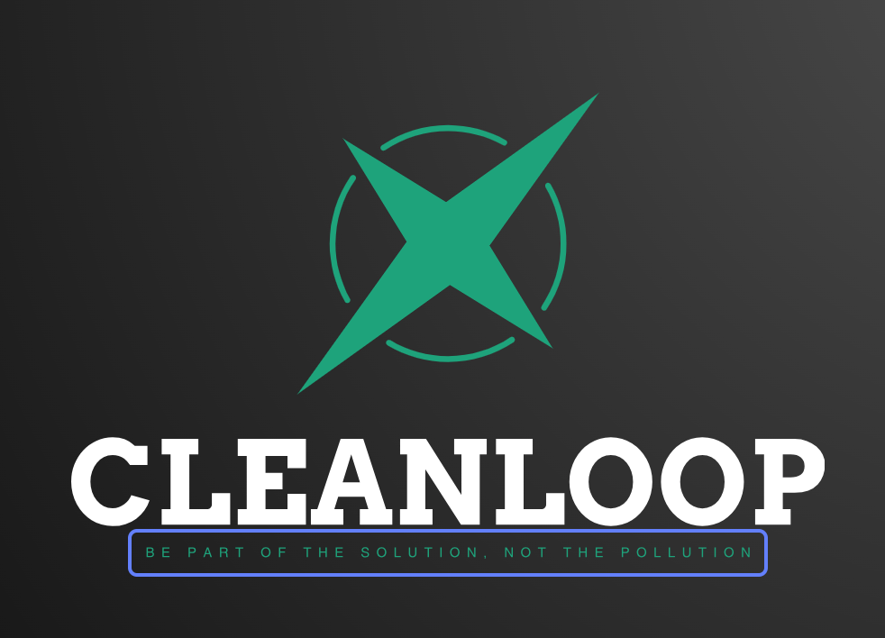

<h1 align="center">cleanLoop</h1>

  Be part of the solution, not the pollution

  <a href="#introduction"><strong>Introduction</strong></a> ·
  <a href="#author"><strong>Authors</strong></a>
  <a href="#dev"><strong>For developers</strong></a>

 

## Description

cleanLoop is a game that allows you to play, pick up and win.
We want to change the way people think about waste and recycling.
Be the person that makes a difference.
Make your neighborhood clean again.
You can simply start to see and play with our demo by going to this webpage: https://www.cleanloop.live

## Authors

- Giuseppe Berardi ([@giusber2005](https://github.com/giusber2005))
- Tara Fardmanesh ([@tarafard](https://github.com/tarafard))
- Pouya Sattari ([@pouyasattari](https://github.com/pouyasattari))

## For developers

you can also try yourselfe the ai model for the trash detection, to do so 
you can simply go to this repository, https://github.com/pouyasattari/trash-detection-cleanloop, and fork it locally

